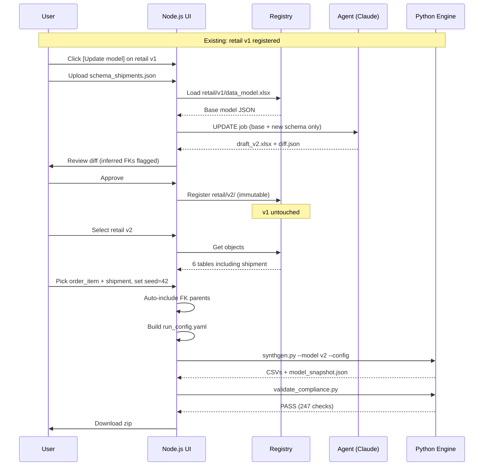

# SynthGen — End-to-End Architecture & Build Guide

> **Purpose:** This document is the single source of truth for building the Synthetic Data Generation Tool with Node.js + Python. Hand it to Cursor or Claude Code and implement phase by phase.

---

## 1. Executive Summary

SynthGen is a **metadata-driven, relationship-aware synthetic data platform**. All domain knowledge lives in a governed **data model workbook** (Excel). A Python engine (`synthgen.py`) reads that workbook plus a run config and produces referentially perfect CSV/XLSX output. An independent validator (`validate_compliance.py`) gates every download — anything less than 100% compliance and no files are released.

The **Node.js tool** wraps this engine with:

1. An **LLM agent** that drafts data models from uploaded schema files (CREATE, UPDATE, or REWRITE mode) and assists config creation
2. A **versioned model registry** with human review before registration
3. A **generation UI** — select model → see tables → pick datasets → set rows/seed → generate → validate → download

**Key design decisions:**

| Question | Answer |
|----------|--------|
| To add a new dataset to an existing model, do I re-upload all schemas? | **No** for UPDATE — upload **only the new schema file.** |
| What if the whole domain changed? | Use **REWRITE** — re-upload all schemas; agent rebuilds the full model. |
| Does the agent need the old schema files again for UPDATE? | **No.** It reads the **existing registered model** from the registry. |
| What does the agent output? | A **draft** with diff — human must review before it goes live. |
| Can I generate from multiple models at once? | **No.** One active model at a time; generation uses only that model. |
| Who builds the config file? | **Agent assists** (from selected tables) + user confirms rows/seed/format. |

### Delivery scope

| Phase | What | Environment |
|-------|------|-------------|
| **Demo (now)** | Local file upload, local registry, local Python engine | Developer laptop |
| **Production (later)** | Multi-user, cloud storage, env-based config, auth | Any environment |

---

## 2. Product Brief (Confirmed)

### The problem

Clients deliver **schemas only** — table structures with no data (security/compliance). Demos, testing, and dashboard builds stall. Hand-written fake data breaks PK/FK relationships and business rules.

### The solution (three artifacts)

```
  SCHEMA FILES          DATA MODEL              CONFIG FILE           GENERATED DATA
  (from client)    →    (workbook .xlsx)   →    (run_config.yaml)  →  (CSV/XLSX)
  columns, types        PK, FK, rules,          which tables,
  no rows                 relations,               row counts,
                          generators               seed, format
```

1. **Data Model** — governed workbook: PK, FK, cardinality, generators, business rules, views. Created/updated by the **agent** from schema files.
2. **Config File** — run instructions: which tables to generate, row counts, seed, output format. Built from **user table selection** (agent can draft defaults).
3. **Generation Script** — `synthgen.py` reads model + config, produces validated synthetic data.

### Agent responsibilities

| Task | Trigger | Agent mode |
|------|---------|------------|
| Create new data model | Upload schema(s) on "Create new model" | `CREATE` |
| Add tables to existing model | Upload new schema on "Update" | `UPDATE` |
| Rebuild entire model | Upload schema(s) on "Rewrite" | `REWRITE` |
| Draft config file | User selects tables + clicks generate (or "Build config") | `CONFIG` |

Agent output is always a **draft** requiring human review — especially inferred FKs and relationships.

---

## 3. UI Design

### 3.1 Layout — two panels, one active model

```
┌─────────────────────────────────────────────────────────────────────────────┐
│  SynthGen — Synthetic Data Generator                                        │
├──────────────────────────────┬──────────────────────────────────────────────┤
│  DATA MODELS                 │  WORKSPACE (context of selected model)       │
│                              │                                              │
│  ┌─ retail_demo      [v2] ◄──┼── ACTIVE (highlighted, only one at a time)   │
│  ├─ delivery_ops     [v1]    │                                              │
│  └─ + Create new model       │  [Tables] [Agent] [Generate]  ← tabs         │
│                              │                                              │
│  Selected: retail_demo v2    │  ┌─────────────────────────────────────────┐ │
│  [Update model] [Rewrite]    │  │  Tables in retail_demo v2 ONLY          │ │
│                              │  │  ☐ category   ☐ customer   ☑ product    │ │
│                              │  │  ☑ sales_order  ☑ order_item            │ │
│                              │  │  Auto-included: (none)                  │ │
│                              │  └─────────────────────────────────────────┘ │
│                              │  Rows: product=500  seed=42  [Generate]     │
└──────────────────────────────┴──────────────────────────────────────────────┘
```

**UI rules (non-negotiable):**

1. **One active model** — clicking a model in the left panel activates it; all tables/config/generation refer to that model only.
2. **Tables scoped to active model** — never show tables from `delivery_ops` while `retail_demo` is selected.
3. **Other models are dimmed/disabled** — not clickable for table selection or generation while one is active.
4. **Generation binds to active model** — `run_config.yaml` always includes `model: registry/retail_demo/v2/data_model.xlsx`; engine never mixes models.

### 3.2 User flows

#### Flow A — Create new model

```
Left panel: "+ Create new model"
    → Upload schema file(s) (.csv, .xlsx, .json, DDL text)
    → Agent CREATE job runs
    → Review draft (PK, FK, generators, rules)
    → Approve → registered as new family (e.g. retail_demo v1)
    → Model appears in left panel, auto-selected as active
```

#### Flow B — Select existing model → generate data

```
Left panel: click "retail_demo v2"  (becomes active)
    → Right panel Tables tab: shows ONLY retail_demo v2 tables
    → User checks tables (e.g. order_item)
    → Tool auto-includes FK parents (sales_order, product, …)
    → User sets row counts + seed
    → Agent CONFIG (optional): drafts run_config.yaml defaults
    → Generate → synthgen.py uses retail_demo v2 model ONLY
    → Validate → download
```

#### Flow C — Update existing model (add new schema)

```
Left panel: click existing model → [Update model]
    → Upload NEW schema file only (.csv / .xlsx)
    → Agent UPDATE job: base model from registry + new schema
    → Review diff: added tables, inferred FKs to existing tables (amber)
    → Approve → new version (v3); old v2 untouched
```

#### Flow D — Rewrite existing model (full rebuild)

```
Left panel: click existing model → [Rewrite model]
    → Upload ALL schema files (full domain refresh)
    → Agent REWRITE job: ignores old structure, rebuilds from schemas
    → Review entire new draft (everything may change)
    → Approve → new version; user warned old table names/generators may differ
    → Use when domain fundamentally changed, not for adding one table
```

### 3.3 UPDATE vs REWRITE — when to use which

| | UPDATE | REWRITE |
|---|--------|---------|
| **Upload** | New schema file(s) only | All schema files for the domain |
| **Existing tables** | Unchanged (frozen) | Regenerated from scratch |
| **New tables** | Added with inferred FKs | Part of full rebuild |
| **Risk** | Low — diff is small | High — may break existing configs/runs |
| **Version** | v(N+1), incremental | v(N+1), full replacement draft |
| **Use when** | Client sends one new dataset | Domain redesign, major schema overhaul |

---

## 4. System Architecture

```
                        ┌─────────────────────────────────────────────────────────┐
                        │                    TOOL (Node.js)                       │
                        │                                                         │
  Schema file(s) ──────►│  ① Upload schema                                        │
  (CSV / DDL / JSON /   │       │                                                 │
   text / Excel)        │       ▼                                                 │
                        │  ② AGENT SERVICE ──────────────────► Claude API           │
                        │       mode: CREATE | UPDATE | REWRITE | CONFIG          │
                        │       │                                                 │
  Existing model ──────►│       │  (UPDATE/REWRITE — loaded from registry)       │
  (registry vN)         │       ▼                                                 │
                        │  ③ Draft model (.xlsx) + STRUCTURED DIFF                │
                        │       inferred FKs flagged ⚠                            │
                        │       │                                                 │
                        │       ▼                                                 │
                        │  ④ HUMAN REVIEW SCREEN                                  │
                        │       approve | edit | reject                           │
                        │       │                                                 │
                        │       ▼                                                 │
                        │  ⑤ MODEL REGISTRY (immutable versions: v1, v2, …)       │
                        │       │                                                 │
                        │       ▼                                                 │
                        │  ⑥ GENERATE UI                                          │
                        │       select model version                              │
                        │       → tables/views from _OBJECTS sheet appear         │
                        │       → user picks datasets (FK parents auto-included)  │
                        │       → rows + seed + format  ==  run_config.yaml       │
                        │       │                                                 │
                        │       ▼                                                 │
                        │  ⑦ GENERATE JOB                                         │
                        │       spawn: python synthgen.py                         │
                        │              --model <registry_path>                    │
                        │              --config <run_config.yaml>               │
                        │       │                                                 │
                        │       ▼                                                 │
                        │  ⑧ VALIDATE GATE                                        │
                        │       spawn: python validate_compliance.py              │
                        │              --snapshot model_snapshot_*.json           │
                        │              --data <output_dir>                        │
                        │       PASS → zip download + run history entry         │
                        │       FAIL → show checks, no download                 │
                        └─────────────────────────────────────────────────────────┘
```

### Technology Stack

| Layer | Technology | Role |
|-------|------------|------|
| Web UI | React (or server-rendered EJS) + existing `demo_tool.html` design | User flows |
| API / orchestration | **Node.js** (Express or Fastify) | REST API, file I/O, job queue |
| Agent | Node.js service → **Claude API** | Schema → draft workbook |
| Model storage | Local filesystem + SQLite metadata | Versioned `.xlsx` + JSON sidecars |
| Generation engine | **Python 3.11+** (`synthgen.py`) | Workbook-driven data synthesis |
| Compliance gate | **Python** (`validate_compliance.py`) | Independent model verification |
| Config format | YAML (`run_config.yaml`) | Per-run targets, seed, output |

---

## 3. The Data Model (Workbook Contract)

The engine has **zero hardcoded domain knowledge**. Everything is declared in an Excel workbook. This is the contract the agent must produce.

### 3.1 Workbook Structure

| Sheet | Purpose |
|-------|---------|
| `_OBJECTS` | Registry of all tables and views. Row 1 = headers. Row 2+ = `object_name \| object_type` (`TABLE` or `VIEW`). Special row: `workbook_version \| 1.1` |
| `<table_name>` | One sheet per table — column definitions (see below) |
| `<view_name>` | One sheet per computed view — spec + derived columns |
| `_RULES` | Business rules applied during generation |

### 3.2 Table Column Schema (per table sheet)

| Column | Description | Example |
|--------|-------------|---------|
| `column_name` | Field name | `order_id` |
| `dtype` | `string`, `int`, `float`, `date`, `bool` | `string` |
| `pk` | `Y` if primary key | `Y` |
| `fk_ref` | `table.column` of parent PK | `sales_order.order_id` |
| `fk_mode` | `REFERENCE` (pick existing parent key) or `SIZING` (child count driven by parent) | `SIZING` |
| `cardinality` | For SIZING: `min,max,distribution` | `1,5,poisson(2.5)` |
| `orphan_pct` | Fraction of parents with zero children | `0.0` |
| `generator` | Value synthesis method (see §3.4) | `pattern` |
| `params` | Semicolon-separated `k=v` pairs | `pattern=ORD-####` |
| `nullable_pct` | Probability of null | `0.0` |
| `unique` | `Y` if values must be unique | `Y` |

### 3.3 View Sheet Schema

```
source_objects     sales_order, order_item
join_logic         sales_order.order_id = order_item.order_id
filter_logic       status != 'CANCELLED'        (optional)
group_by           customer_id                  (optional)

column_name | dtype  | derivation
total_lines | int    | count(order_item_id)
revenue     | float  | round(sum(line_total), 2)
```

### 3.4 Supported Generators

| Generator | Params | Use case |
|-----------|--------|----------|
| `pattern` | `pattern=ORD-####` | Structured IDs (`#` = digit, `?` = letter) |
| `choice` | `values=A,B,C; weights=0.6,0.3,0.1` | Categorical with optional weights |
| `faker` | `provider=email` | Realistic PII (Faker library) |
| `numeric` | `dist=uniform; min=1; max=100; round=2` | Numbers (uniform, uniform_int, lognormal) |
| `date` | `start=2024-01-01; end=2025-12-31` | Random dates in range |
| `date_offset` | `base=order_date; min_days=1; max_days=14` | Date relative to another column |
| `sequence` | `scope=order_id; start=1` | Contiguous line numbers per group |
| `fk_lookup` | `source=product.unit_price` | Exact copy from parent via FK |
| `fk_lookup_jitter` | `source=product.unit_price; jitter_pct=0.1` | Parent value ± jitter % |
| `derived` | `expr=quantity * unit_price; round=2` | pandas eval expression |
| `case` | `when1=status=='DELIVERED'; then1=DELIVERED; else=PENDING` | Conditional status logic |

### 3.5 Rule Types (`_RULES` sheet)

| rule_type | definition example |
|-----------|-------------------|
| `temporal_order` | `order_date <= ship_date <= delivery_date` |
| `conditional` | `when status == 'PLACED' then delivery_date NULL` |
| `bound` | `delivery_date >= ship_date` |
| `derived` | `line_total = quantity * unit_price` |

---

## 5. Agent Modes — Detailed Flow

### 5.1 CREATE Mode (new domain)

```
User uploads:  schema_retail_orders.csv, schema_retail_products.sql
                    │
                    ▼
Agent receives:  [schema files only]
                    │
                    ▼
Agent outputs:   draft_model_v1.xlsx
                 + manifest.json (tables found, generators proposed, FK guesses)
                    │
                    ▼
Human reviews:   all tables, all relationships, all generators
                    │
                    ▼
Registry:        models/retail/v1/data_model.xlsx  (immutable)
```

### 5.2 UPDATE Mode (add dataset to existing model)

```
User has:        models/retail/v1/  (registered, 4 tables)
User clicks:     [Update model] on retail v1
User uploads:    schema_shipments.json   ← ONLY the new schema
                    │
                    ▼
Tool loads:      registry entry retail/v1  (full workbook, NOT re-uploaded)
Agent receives:  {
                   mode: "UPDATE",
                   base_model: <parsed JSON of v1 workbook>,
                   new_schema: <parsed shipments schema>
                 }
                    │
                    ▼
Agent tasks:
  1. Add new sheet `shipment` with columns from schema
  2. Add `shipment` row to `_OBJECTS`
  3. INFER relationships:
     - Column `order_id` in shipment → match against existing PKs
       (sales_order.order_id ✓)
     - Column `customer_id` → customer.customer_id ✓
  4. Propose generators (pattern for shipment_id, fk_ref for order_id, etc.)
  5. Propose cardinality if SIZING (e.g. 1-3 shipments per order)
  6. Flag every inferred FK with confidence: HIGH | MEDIUM | LOW
                    │
                    ▼
Agent outputs:   draft_model_v2.xlsx
                 + diff.json:
                   {
                     "added_tables": ["shipment"],
                     "added_rules": [],
                     "inferred_fks": [
                       {
                         "column": "shipment.order_id",
                         "fk_ref": "sales_order.order_id",
                         "confidence": "HIGH",
                         "reason": "column name matches existing PK"
                       }
                     ],
                     "modified_tables": [],
                     "unchanged_tables": ["category","customer","product","sales_order","order_item"]
                   }
                    │
                    ▼
Human reviews:   diff screen — MUST confirm each inferred FK
                    │
                    ▼
Registry:        models/retail/v2/data_model.xlsx
                 models/retail/v1/  ← untouched, still used by old run snapshots
```

### 5.3 REWRITE Mode (rebuild entire model)

```
User clicks:     [Rewrite model] on retail v2
User uploads:    ALL schema files (orders.csv, products.xlsx, shipments.json, …)
                    │
                    ▼
Agent receives:  {
                   mode: "REWRITE",
                   family_id: "retail",
                   base_version: 2,              // for lineage only — NOT copied
                   schema_files: [all uploads]
                 }
                    │
                    ▼
Agent tasks:
  1. Parse all schemas from scratch
  2. Build complete new workbook (all tables, FKs, generators, rules)
  3. May rename tables, change generators, alter relationships vs v2
  4. Output diff vs v2 showing EVERYTHING that changed
                    │
                    ▼
Human reviews:   FULL diff — warn that this replaces model structure
                    │
                    ▼
Registry:        retail/v3/data_model.xlsx  (v2 still frozen for old runs)
```

### 5.4 CONFIG Mode (agent assists config file)

```
User has:        active model retail v2, selected tables [product, sales_order, order_item]
                    │
                    ▼
Agent receives:  {
                   mode: "CONFIG",
                   model: <parsed retail v2>,
                   selected_tables: ["product", "sales_order", "order_item"]
                 }
                    │
                    ▼
Agent proposes:  run_config.yaml draft:
                   - FK closure (auto-included parents)
                   - SIZING tables → rows: derived
                   - Suggested row counts for root tables (based on table semantics)
                   - Default seed, locale, format
                    │
                    ▼
User edits:      row counts, seed in UI → confirms → Generate
```

Config is always bound to the **active model path** — never references another model.

### 5.5 Why Only the New Schema for UPDATE?

| Approach | Problem |
|----------|---------|
| Re-upload all schemas every time | Drift risk — agent may silently change v1 tables; breaks reproducibility |
| Re-upload old + new together | Same drift risk; wastes tokens; confuses diff |
| **Registry base + new schema only** | Agent starts from canonical vN; diff is minimal and auditable; v1 frozen |

### 5.6 Non-Negotiable Rules

> **Every agent output is a DRAFT.** Inferred FKs are the highest-risk artifact — a wrong `order_id → wrong_table.order_id` silently corrupts every future generation. The review screen must show a structured diff with inferred relationships highlighted in amber. Registration is blocked until a human explicitly approves.

> **One model at a time in the UI.** The active model ID is stored in app state. All table lists, config builders, and generation jobs include `model_family` + `model_version`. The server rejects generation requests where selected tables don't belong to the specified model.

> **Model isolation at generation time.** `synthgen.py` receives exactly one `--model` path. Config `targets` keys must be a subset of that model's `_OBJECTS` tables. Server validates before spawning Python.

---

## 6. Model Registry

### 5.1 Directory Layout

```
registry/
├── index.json                          # catalog of all model families
├── retail/
│   ├── meta.json                       # family metadata, tags, owner
│   ├── v1/
│   │   ├── data_model.xlsx             # immutable registered workbook
│   │   ├── manifest.json               # tables, views, rules summary
│   │   ├── source_schemas/             # original uploads that created v1
│   │   │   ├── orders.csv
│   │   │   └── products.sql
│   │   └── registration.json           # who approved, when, agent job id
│   └── v2/
│       ├── data_model.xlsx
│       ├── manifest.json
│       ├── diff_from_v1.json           # what changed
│       ├── source_schemas/
│       │   └── shipments.json          # ONLY the new schema for v2
│       └── registration.json
└── delivery/
    └── v1/
        └── ...
```

### 5.2 `index.json`

```json
{
  "families": [
    {
      "id": "retail",
      "display_name": "Retail Demo",
      "latest_version": 2,
      "versions": [1, 2],
      "created_at": "2026-07-12T10:00:00Z"
    }
  ]
}
```

### 5.3 Version Immutability

- Once registered, `data_model.xlsx` for version N is **never modified**.
- UPDATE always produces version N+1.
- Generation runs store `model_snapshot_<run_id>.json` (already done by `synthgen.py`) pointing to the exact parsed model — old runs replay identically.

---

## 6. Agent Service Design

### 6.1 Agent Job Lifecycle

```
PENDING → RUNNING → DRAFT_READY → (human) → APPROVED → REGISTERED
                              └→ REJECTED
                              └→ EDITING → DRAFT_READY (re-validate)
```

### 6.2 Agent Input Contract

```typescript
interface AgentJobRequest {
  mode: "CREATE" | "UPDATE" | "REWRITE" | "CONFIG";
  family_id?: string;           // required for UPDATE, REWRITE, CONFIG
  base_version?: number;        // required for UPDATE, REWRITE
  selected_tables?: string[];   // required for CONFIG
  schema_files: Array<{
    filename: string;
    format: "csv" | "ddl" | "json" | "text" | "xlsx";
    content: string;            // or path after upload
  }>;
  domain_hint?: string;         // optional: "retail", "logistics"
}
```

### 6.3 Agent Output Contract

```typescript
interface AgentJobResult {
  draft_workbook_path: string;
  diff: {
    added_tables: string[];
    added_views: string[];
    added_rules: Rule[];
    inferred_fks: InferredFK[];   // confidence + reason
    modified_tables: TableChange[];
    unchanged_tables: string[];
  };
  manifest: {
    tables: Record<string, { columns: number; pk: string }>;
    warnings: string[];
  };
}
```

### 6.4 Agent System Prompt (skeleton)

```
You are a data modeling agent for SynthGen. You produce Excel workbooks that
conform to the SynthGen workbook contract (see ARCHITECTURE.md §3).

MODE: {CREATE|UPDATE|REWRITE|CONFIG}

{IF UPDATE}
You are extending model family "{family_id}" version {base_version}.
The existing model JSON is provided below. DO NOT modify any existing table
sheets. Only add new objects and update _OBJECTS and _RULES as needed.

{IF REWRITE}
You are rebuilding model family "{family_id}" from scratch using all provided
schema files. Ignore the structure of version {base_version} except for lineage.
Build a complete new workbook from all schemas.

{IF CONFIG}
Given the active model and user-selected tables, produce a run_config.yaml draft.
Apply FK closure (include all parent tables). Use rows: derived for SIZING tables.
Suggest sensible default row counts for root tables.

For every column in the new schema ending in _id, _pk, or _ref:
1. Search existing tables for matching primary keys
2. Propose fk_ref with confidence HIGH/MEDIUM/LOW
3. Default to REFERENCE fk_mode unless child-per-parent sizing is obvious

{ENDIF}

For each column without fk_ref, propose an appropriate generator from:
pattern, choice, faker, numeric, date, date_offset, sequence, fk_lookup,
fk_lookup_jitter, derived, case.

Output: a valid .xlsx workbook + JSON diff sidecar.
```

### 6.5 Schema Parsing (pre-agent)

Node.js normalizes uploads before sending to the agent:

| Input format | Parser |
|--------------|--------|
| CSV | First row = headers; infer dtypes from sample rows |
| DDL (`CREATE TABLE`) | `node-sql-parser` or regex extraction |
| JSON Schema | Direct field mapping |
| Plain text | Pass through to LLM with structure hint |
| Excel | `xlsx` npm package — sheet per table or flat column list |

Output: normalized `ParsedSchema[]` JSON that the agent consumes uniformly.

---

## 7. Generation Flow (Steps ④–⑧)

### 7.1 UI Pipeline (matches `demo_tool.html` rail)

```
[Select Model] → [Pick Datasets] → [Configure] → [Generate] → [Validate] → [Download]
```

### 7.2 Select Model

- Dropdown: `retail v2 (latest)` | `retail v1` | `delivery v1`
- On select: API returns objects from `_OBJECTS` → render table/view grid

### 7.3 Pick Datasets (FK auto-resolution)

Port the logic from `demo_tool.py`:

```javascript
// Transitive FK closure — if user picks order_item, auto-include sales_order, product, customer
function resolveDependencies(selectedTables, model) {
  const parentsOf = buildParentMap(model);
  const resolved = new Set(selectedTables);
  let changed = true;
  while (changed) {
    changed = false;
    for (const t of resolved) {
      for (const parent of parentsOf[t] || []) {
        if (!resolved.has(parent)) { resolved.add(parent); changed = true; }
      }
    }
  }
  return [...resolved];
}
```

Show info banner: `Auto-included FK parents: sales_order, product`

### 7.4 Configure → `run_config.yaml`

The UI **is** the config builder. Example output:

```yaml
model: registry/retail/v2/data_model.xlsx
seed: 42
locale: en_US
targets:
  category:    {rows: 6}
  customer:    {rows: 300}
  product:     {rows: 500}
  sales_order: {rows: derived}    # SIZING child — row count from parent cardinality
  order_item:  {rows: derived}
  shipment:    {rows: derived}
output:
  format: [csv, xlsx]
  path: ./runs/run_20260712T103045Z/
```

**Rules:**
- Tables with `fk_mode=SIZING` → `rows: derived` (UI shows disabled pill, not editable)
- User-selected row counts only for root/parent tables
- Seed + locale + format from UI controls

### 7.4.1 Output Format (CSV / Excel) — Required

Generated data is always delivered as **CSV and/or Excel (`.xlsx`)**. This is a first-class product requirement, not optional.

| Format | Produced by | Delivery |
|--------|-------------|----------|
| `csv` | one `.csv` file per table | individual files + zip |
| `xlsx` | single `synthetic_data.xlsx`, one sheet per table (≤ Excel row limit) | direct download |

**Rules:**
- The UI format control offers **CSV**, **Excel**, or **both** (default: both).
- At least one format must be selected — the API rejects an empty format list.
- `output.format` in `run_config.yaml` is an array: `[csv]`, `[xlsx]`, or `[csv, xlsx]`.
- `synthgen.py` already emits both formats (CSV always per-table; XLSX one sheet per table, skipping objects over the Excel row limit of 1,048,576).
- After a validation PASS, the API bundles all produced files into a single **`<run_id>.zip`** for one-click download, and also exposes each file individually.
- On validation FAIL, **no files (CSV or Excel) are offered** — the gate blocks all output.

### 7.5 Generate Job (Node.js → Python)

```javascript
async function runGeneration(configPath, modelPath) {
  // Step 1: synthgen
  const gen = await spawn('python', [
    'engine/synthgen.py',
    '--model', modelPath,
    '--config', configPath
  ]);
  if (gen.exitCode !== 0) throw new Error(gen.stderr);

  // Step 2: find snapshot written by synthgen
  const snapshot = glob(`${outputPath}/model_snapshot_*.json`)[0];

  // Step 3: validate_compliance (independent gate)
  const val = await spawn('python', [
    'engine/validate_compliance.py',
    '--snapshot', snapshot,
    '--data', outputPath
  ]);

  return { passed: val.exitCode === 0, report: parseValidationOutput(val.stdout) };
}
```

### 7.6 Validation Gate

Two layers (already in demo):

| Layer | Script | When | What |
|-------|--------|------|------|
| Inline | `synthgen.validate_output()` | During generation | PK unique, FK orphans, view reconciliation |
| Independent | `validate_compliance.py` | After generation, before download | Full model compliance: patterns, weights, rules, view recomputation |

**Download is blocked unless both pass.**

### 7.7 Run History

```json
{
  "run_id": "20260712T103045Z",
  "family_id": "retail",
  "model_version": 2,
  "seed": 42,
  "targets": ["category","customer","product","sales_order","order_item"],
  "status": "PASS",
  "output_path": "runs/run_20260712T103045Z/",
  "snapshot": "runs/run_20260712T103045Z/model_snapshot_20260712T103045Z.json",
  "files": ["category.csv","customer.csv", "..."],
  "row_counts": {"category": 6, "customer": 300, "..."}
}
```

Stored in SQLite `runs` table. Enables: "rerun with same seed" and audit trail.

---

## 8. API Endpoints

### 8.1 Schema & Agent

| Method | Path | Description |
|--------|------|-------------|
| `POST` | `/api/schemas/upload` | Upload schema file(s), returns `upload_id` |
| `POST` | `/api/agent/jobs` | Start CREATE, UPDATE, REWRITE, or CONFIG job |
| `GET` | `/api/agent/jobs/:id` | Poll job status |
| `GET` | `/api/agent/jobs/:id/draft` | Download draft workbook + diff JSON |
| `POST` | `/api/agent/jobs/:id/approve` | Human approves → registers new version |
| `POST` | `/api/agent/jobs/:id/reject` | Reject draft |
| `PUT` | `/api/agent/jobs/:id/draft` | Upload human-edited workbook before approve |

### 8.2 Model Registry

| Method | Path | Description |
|--------|------|-------------|
| `GET` | `/api/models` | List all families + versions |
| `GET` | `/api/models/:family/:version` | Model metadata + objects list |
| `GET` | `/api/models/:family/:version/objects` | Tables/views for generation UI |
| `GET` | `/api/models/:family/:version/download` | Download registered workbook |

### 8.3 Generation

| Method | Path | Description |
|--------|------|-------------|
| `POST` | `/api/generate` | `{family, version, targets, seed, format}` → starts job. `format` ⊆ `["csv","xlsx"]`, non-empty |
| `GET` | `/api/generate/:run_id` | Poll status + validation results |
| `GET` | `/api/generate/:run_id/download` | Zip of all produced files (CSV + Excel), only if PASS |
| `GET` | `/api/generate/:run_id/files/:name` | Download a single CSV/XLSX file, only if PASS |
| `GET` | `/api/runs` | Run history |

---

## 9. Project Structure (Implementation Target)

```
synthetic-data-gen/
├── docs/
│   └── ARCHITECTURE.md              ← this file
├── Design docs/                     ← reference demo (keep as-is)
│   └── demo_package/
│       ├── synthgen.py
│       ├── validate_compliance.py
│       ├── demo_tool.py
│       ├── run_config_demo.yaml
│       └── DEMO_GUIDE.md
├── engine/                          ← Python (copy from demo_package)
│   ├── synthgen.py
│   ├── validate_compliance.py
│   └── requirements.txt
├── server/                          ← Node.js
│   ├── package.json
│   ├── src/
│   │   ├── index.ts                 # Express/Fastify entry
│   │   ├── routes/
│   │   │   ├── agent.ts
│   │   │   ├── models.ts
│   │   │   └── generate.ts
│   │   ├── services/
│   │   │   ├── agentService.ts      # Claude API integration
│   │   │   ├── schemaParser.ts      # CSV/DDL/JSON → ParsedSchema
│   │   │   ├── registryService.ts   # versioned model CRUD
│   │   │   ├── diffService.ts       # workbook diff for review UI
│   │   │   ├── dependencyResolver.ts
│   │   │   └── generationService.ts # spawn Python, gate downloads
│   │   ├── db/
│   │   │   └── sqlite.ts              # runs, agent_jobs tables
│   │   └── utils/
│   │       └── workbookBuilder.ts   # programmatic .xlsx creation
│   └── tsconfig.json
├── client/                          ← React frontend
│   ├── package.json
│   ├── src/
│   │   ├── pages/
│   │   │   ├── ModelsPage.tsx       # list + create/extend
│   │   │   ├── ReviewPage.tsx       # diff + approve
│   │   │   └── GeneratePage.tsx     # select → pick → config → run
│   │   └── components/
│   │       ├── PipelineRail.tsx     # from demo_tool.html
│   │       ├── ObjectGrid.tsx
│   │       ├── DiffViewer.tsx
│   │       └── ValidationCards.tsx
│   └── ...
├── registry/                        # runtime data (gitignored)
├── runs/                            # generation output (gitignored)
├── uploads/                         # schema uploads (gitignored)
├── .env.example                     # ANTHROPIC_API_KEY, PYTHON_PATH
├── .gitignore
└── README.md
```

---

## 10. Build Phases (for Cursor / Claude Code)

Implement in order. Each phase is independently testable.

### Phase 1 — Engine Foundation (Day 1)

**Goal:** Python engine works standalone.

```bash
cd engine
pip install -r requirements.txt
# Copy data_model_demo.xlsx from Design docs when available
python synthgen.py --model ../Design\ docs/demo_package/data_model_demo.xlsx --config ../Design\ docs/demo_package/run_config_demo.yaml
python validate_compliance.py --snapshot ./output/run_retail_demo/model_snapshot_*.json --data ./output/run_retail_demo/
```

**Acceptance:** QA report PASS, CSVs generated.

**Prompt for AI:**
> Copy synthgen.py and validate_compliance.py from Design docs/demo_package into engine/. Create requirements.txt with pandas, numpy, faker, openpyxl, pyyaml. Verify generation + validation pass.

---

### Phase 2 — Node.js Shell + Generation API (Day 2)

**Goal:** Node spawns Python, gates downloads.

**Prompt for AI:**
> Create server/ with Express + TypeScript. Implement POST /api/generate that writes run_config.yaml, spawns engine/synthgen.py, then engine/validate_compliance.py. Return validation report. Block download on FAIL. Store run in SQLite.

**Acceptance:** `curl -X POST /api/generate` with JSON body produces same output as manual Python run.

---

### Phase 3 — Model Registry (Day 3)

**Goal:** Versioned model storage + object listing.

**Prompt for AI:**
> Implement registry/ layout per ARCHITECTURE.md §5. API: GET /api/models, GET /api/models/:family/:version/objects. Objects parsed from _OBJECTS sheet using openpyxl or xlsx npm. Seed registry with demo workbook as retail/v1.

**Acceptance:** API returns table list matching demo workbook.

---

### Phase 4 — Generation UI (Day 4)

**Goal:** Browser UI for select → pick → generate → download.

**Prompt for AI:**
> Build React client using demo_tool.html design (PipelineRail, ObjectGrid, ValidationCards). Wire to Phase 2+3 APIs. FK dependency auto-resolution per demo_tool.py logic. SIZING tables show "derived" pill.

**Acceptance:** Full demo flow works in browser without Streamlit.

---

### Phase 5 — Agent CREATE Mode (Day 5–6)

**Goal:** Upload schemas → draft workbook.

**Prompt for AI:**
> Implement agent service with Claude API. Schema parser for CSV and DDL. CREATE mode: schemas in → draft .xlsx out + manifest.json. Job polling API. Do NOT auto-register — status stays DRAFT_READY.

**Acceptance:** Upload a CSV schema, get back a valid draft workbook that passes `synthgen.validate_model()`.

---

### Phase 6 — Human Review + Registration (Day 7)

**Goal:** Diff screen, approve flow, immutable registration.

**Prompt for AI:**
> Build ReviewPage with DiffViewer showing added tables, inferred FKs (amber highlight), added rules. Approve → copies draft to registry/{family}/v{N+1}/. Reject → discards. PUT endpoint for human-edited workbook before approve.

**Acceptance:** Approve a draft → new version appears in model list. Old version unchanged.

---

### Phase 7 — Agent UPDATE + REWRITE Modes (Day 8–9)

**Goal:** Add new schema (UPDATE) or rebuild model (REWRITE).

**Prompt for AI:**
> Implement UPDATE mode per ARCHITECTURE.md §5.2 — registry base + new schema only, diff with inferred FKs. Implement REWRITE mode per §5.3 — all schemas uploaded, full rebuild, full diff vs previous version. Both require human review before registration.

**Acceptance:**
1. UPDATE: upload one new schema → v(N+1) with added table, vN untouched
2. REWRITE: upload all schemas → v(N+1) with full new structure, diff shows all changes
3. Generate from either version uses only that version's model

---

### Phase 8 — Polish (Day 10)

- Run history page with rerun-same-seed
- Zip download of all CSVs
- Error handling + loading states
- `.env.example` with required keys
- README with quickstart

---

### Phase 9 — Network Deployment (Day 11–12)

**Goal:** Run the tool on any network — same LAN, remote office, or public internet — not just `localhost`.

After Phases 1–8 the app is a **local single-machine demo**. Phase 9 makes it a **deployable service** reachable from other machines and networks.

**Scope:**

| Area | Deliverable |
|------|-------------|
| **Bind address** | `HOST=0.0.0.0` so the server listens on all interfaces (not only `127.0.0.1`) |
| **Production server** | Process manager (PM2 / systemd) or Docker Compose for Node + Python + volumes |
| **Reverse proxy** | nginx or Caddy in front of the app — TLS termination, static assets, upload size limits |
| **HTTPS** | Valid certificates (Let's Encrypt or corporate CA) for browser access over untrusted networks |
| **Persistent storage** | Mounted volumes for `registry/`, `runs/`, `uploads/`, SQLite DB — survive container restarts |
| **Environment config** | `.env.production.example` with `HOST`, `PORT`, `PUBLIC_URL`, `PYTHON_PATH`, API keys |
| **Authentication** | Basic auth or SSO proxy so the tool is not open to the whole internet by default |
| **Firewall / ports** | Document inbound rules (e.g. 443 → proxy → 3080) |
| **Health check** | `GET /api/health` for load balancers and uptime monitors |
| **Deploy guide** | README section: LAN access, Docker, cloud VM (AWS/Azure/GCP), optional Kubernetes |

**Acceptance:**

1. **LAN:** Another machine on the same network opens `http://<server-ip>:3080` and completes create → review → generate → download
2. **Internet (with proxy):** `https://synthgen.example.com` serves UI + API over TLS
3. **Restart-safe:** Registry, runs, and drafts persist after server/container restart
4. **Secured:** Unauthenticated public access is blocked (auth or VPN documented)

**Prompt for AI:**
> Add HOST config to server, health endpoint, Docker Compose (Node + Python engine), nginx/Caddy example, `.env.production.example`, and a DEPLOYMENT.md covering LAN, cloud VM, and HTTPS reverse-proxy setup. Do not change engine or agent logic — only packaging, networking, and ops.

**Out of scope (future):** Multi-tenant SaaS, horizontal scaling of Python workers, managed cloud registry (S3/GCS) — can be Phase 10+ if needed.

**Status:** Implemented — see `DEPLOYMENT.md`, `Dockerfile`, `docker-compose.yml`, `server/.env.production.example`.

---

## 11. Environment & Prerequisites

```bash
# System (already installed per user)
node --version    # 18+
git --version
python --version  # 3.11+

# Python deps
pip install pandas numpy faker openpyxl pyyaml

# Node deps (created during build)
npm install express typescript @anthropic-ai/sdk better-sqlite3
npm install xlsx js-yaml uuid multer
```

### `.env.example`

```
ANTHROPIC_API_KEY=sk-ant-...
PYTHON_PATH=python
PORT=3000
REGISTRY_PATH=./registry
RUNS_PATH=./runs
UPLOADS_PATH=./uploads
```

---

## 12. Data Flow Diagram (UPDATE scenario)



---

## 13. Key Invariants (Do Not Break)

1. **Engine has zero domain knowledge** — all logic in the workbook
2. **Agent output is always a draft** — never auto-registered
3. **Inferred FKs require human confirmation** — shown in diff, amber flagged
4. **Registry versions are immutable** — UPDATE/REWRITE create N+1, never edit N
5. **UPDATE needs only the new schema** — base model from registry
6. **One active model in UI** — tables and generation scoped to selected model only
6. **Validation gates download** — inline + independent compliance check
7. **Runs snapshot the model** — `model_snapshot_<run_id>.json` for reproducibility
8. **FK parents auto-included** — user cannot accidentally orphan child tables
9. **SIZING tables use `rows: derived`** — row count driven by cardinality, not user input

---

## 14. Reference: Existing Demo Assets

| File | Role in final tool |
|------|-------------------|
| `Design docs/demo_package/synthgen.py` | Copy to `engine/` — generation engine |
| `Design docs/demo_package/validate_compliance.py` | Copy to `engine/` — compliance gate |
| `Design docs/demo_package/demo_tool.py` | Reference for UI logic (FK closure, SIZING, validation cards) |
| `Design docs/demo_package/run_config_demo.yaml` | Reference config format |
| `Design docs/demo_package/DEMO_GUIDE.md` | Sales/demo talk track |
| `Design docs/demo_tool.html` | Visual design reference for React UI |

---

## 15. Quickstart Prompt (paste into Cursor)

```
Read docs/ARCHITECTURE.md and Design docs/demo_package/ in this repo.

Build Phase 1: copy the Python engine into engine/, create requirements.txt,
verify synthgen.py + validate_compliance.py run successfully.

Then proceed to Phase 2: Node.js Express server with POST /api/generate that
spawns the Python engine and gates downloads on validate_compliance.py PASS.

Follow the architecture exactly:
- Versioned model registry (§5)
- CREATE, UPDATE, REWRITE, and CONFIG agent modes (§5)
- Agent drafts require human review (§5.6)
- Single active model — tables scoped to selection (§3.1)
- FK auto-resolution in generation UI (§7.3)
- Validation gate before download (§7.6)
```

---

*Document version: 1.1 — 2026-07-13 (added Phase 9 — Network Deployment)*
